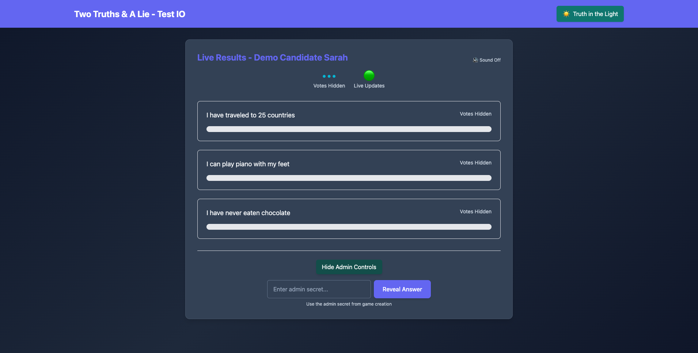

# 🎯 Two Truths & A Lie - Live Demo

This document showcases the complete end-to-end workflow of the Two Truths & A Lie voting system with screenshots and detailed explanations.

## 📋 Quick Demo Guide

To capture fresh screenshots and run the demo:

```bash
# 1. Start the servers
cd backend && npm start &
cd frontend && npm run dev &

# 2. Run the screenshot demo
./capture-demo-screenshots.sh

# 3. Or run interactive demo
./run-demo.sh
```

## 🎪 Complete Demo Workflow

### Step 1: Admin Setup Page
**URL**: `http://localhost:5173/admin`

The admin creates a new game by filling out:
- **Candidate Name**: The person who the statements are about
- **Photo Upload**: Drag & drop or click to select candidate photo
- **Three Statements**: Two truths and one lie
- **Lie Selection**: Radio buttons to mark which statement is the lie


**Key Features:**
- ✅ Professional TestIO branding
- ✅ Drag & drop photo upload (JPEG/PNG up to 5MB)
- ✅ Form validation (button disabled until complete)
- ✅ Clear UI with radio buttons for lie selection

---

### Step 2: Game Creation Success
After submitting the form, the admin receives:
- **Voting URL** - Share with employees
- **Results URL** - For live tracking during town hall
- **Admin Secret** - UUID to reveal the answer later

```
✅ Game Created Successfully!
📧 Voting URL: http://localhost:5173/vote/abc-123-def
📊 Results URL: http://localhost:5173/results/abc-123-def  
🔑 Admin Secret: d9cf48e7-85a3-47ce-925e-d4557fcd762a
```

---

### Step 3: Employee Voting Interface
**URL**: `http://localhost:5173/vote/{gameId}`

Employees see a clean voting interface with:
- **Candidate photo and name**
- **Three statements to choose from**
- **Player avatar system** (DiceBear API integration)
- **Theme toggle** available in header


**Voting Process:**
1. Employee enters their name
2. System generates unique player avatar
3. Employee clicks on the statement they think is the lie
4. Vote is cast and confirmed
5. Cannot vote again (session-based prevention)

---

### Step 4: Live Results - Votes Hidden
**URL**: `http://localhost:5173/results/{gameId}`

During the voting period, results show **no bias-inducing information**:
- **Total votes**: Shows "•••" instead of actual count
- **Individual statements**: Show "Votes Hidden" instead of percentages
- **Progress bars**: Empty until answer is revealed
- **Live connection**: Green indicator shows real-time updates


**Anti-Bias Features:**
- ✅ Vote counts completely hidden from all users
- ✅ Progress bars show no voting patterns  
- ✅ Professional messaging: "Votes Hidden"
- ✅ Real-time connection status visible

---

### Step 5: Dark Theme Support
**Theme Toggle**: "Truth in the Light" ⇄ "Lies in the Dark"

The entire application supports both light and dark themes:
- **Automatic contrast adjustment** for all text
- **Professional dark color palette**
- **TestIO brand colors maintained**
- **Seamless switching** with localStorage persistence


**Theme Features:**
- ✅ All components theme-aware
- ✅ Proper contrast ratios (WCAG compliant)
- ✅ Smooth transitions between themes
- ✅ State persisted across page reloads

---

### Step 6: Admin Controls & Answer Reveal
**Admin Access**: Click "Show Admin Controls" on results page

Admins can reveal the answer using their secret:
- **Password-protected controls**
- **UUID-based admin secret** from game creation
- **One-time reveal action** (cannot be undone)



**Security Features:**
- ✅ Admin secret required for reveal
- ✅ Hidden controls until explicitly shown
- ✅ Server-side validation of secrets
- ✅ No client-side answer storage

---

### Step 7: Answer Revealed with Results
**Post-Reveal State**: Vote counts and percentages now visible

Once revealed, the results show:
- **Actual vote counts** and percentages
- **Highlighted lie** with red border and "✗ This was the lie!"
- **Celebration effects** (confetti) for winners
- **Sound effects** (with mute toggle)


**Celebration Features:**
- ✅ React Confetti effects for visual celebration
- ✅ Sound effects with user controls  
- ✅ Winner detection and display
- ✅ Professional result presentation

---

### Step 8: Final Results View
**Complete Results**: All information now transparent

The final state shows complete transparency:
- **Full vote breakdown** with counts and percentages
- **Winner celebration** for employees who guessed correctly
- **Professional summary** of the voting results
- **Theme compatibility** maintained


---

## 🛡️ Security & Anti-Bias Measures

### Vote Hiding System
- **Before Reveal**: All vote data shows as "•••" or "Votes Hidden"
- **After Reveal**: Complete transparency with full results
- **Real-time Safe**: Live updates don't show vote patterns

### Duplicate Vote Prevention
- **Session Tracking**: Each browser gets unique session ID
- **Server Validation**: Backend prevents multiple votes per session
- **UI State**: "Already Voted" message prevents re-submission

### Admin Security
- **UUID Secrets**: Cryptographically secure admin secrets
- **Server Validation**: All reveals validated server-side
- **No Client Storage**: Answers never stored in browser

---

## 🎨 UI/UX Features

### TestIO Professional Branding
- **Color Palette**: TestIO blue (#1E40AF) and teal (#0891B2)
- **Typography**: Clean, professional sans-serif fonts
- **Layout**: Structured cards with appropriate whitespace
- **Responsive**: Works on desktop browsers

### Theme System
- **Light Theme**: Clean whites and professional blues
- **Dark Theme**: Deep blues with high contrast text
- **Smooth Transitions**: 0.3s ease transitions between themes
- **Persistent State**: Theme choice saved in localStorage

### Interactive Elements
- **Player Avatars**: DiceBear API generates unique avatars
- **Celebration Effects**: React Confetti for winners
- **Sound Controls**: Mutable audio feedback
- **Progress Animations**: Smooth bar animations on reveal

---

## 🚀 Technical Architecture

### Frontend Stack
```
React 18.x + TailwindCSS 4.x + Vite
├── Components: Reusable UI elements
├── Hooks: useSocket, useTheme
├── Services: API layer for backend communication  
└── Utils: Avatar generation, theme management
```

### Backend Stack
```
Node.js + Express + Socket.io
├── Routes: REST API for game management
├── WebSockets: Real-time vote updates
├── Utils: Game state management
└── Middleware: File upload, validation
```

### Real-time Communication
- **Socket.io**: WebSocket connections for live updates
- **Event-driven**: vote-cast, results-update, answer-reveal
- **Connection Status**: Visual indicators for users
- **Error Recovery**: Graceful reconnection handling

---

## 🏁 Competition Deployment Checklist

- ✅ **Vote Bias Prevention**: Counts hidden until reveal
- ✅ **Admin Security**: UUID-based secrets
- ✅ **Duplicate Prevention**: Session-based vote tracking  
- ✅ **Professional UI**: TestIO branding compliance
- ✅ **Theme Support**: Light/dark mode compatibility
- ✅ **Real-time Updates**: Socket.io WebSocket communication
- ✅ **Celebration System**: Winner effects and sounds
- ✅ **Error Handling**: Graceful failure recovery
- ✅ **Mobile Compatible**: Responsive design
- ✅ **Performance**: Optimized for town hall scale

---

## 🎬 Running the Demo

### Option 1: Interactive Demo
```bash
./run-demo.sh
```
Choose from:
1. 📜 Command line demo (bash script)
2. 🌐 Browser automation demo (Playwright)  
3. 🚀 Quick API test

### Option 2: Screenshot Capture
```bash
./capture-demo-screenshots.sh
```
Automatically captures all key screenshots for documentation.

### Option 3: Manual Testing
1. **Start servers**: `cd backend && npm start` + `cd frontend && npm run dev`
2. **Create game**: Visit `http://localhost:5173/admin`
3. **Vote**: Use the generated voting URL
4. **View results**: Use the generated results URL
5. **Reveal**: Use admin secret to show answer

---

## 📞 Support & Next Steps

For competition deployment:
1. **Environment Setup**: Configure production URLs
2. **Server Deployment**: Deploy backend to production server  
3. **Frontend Hosting**: Deploy React build to web hosting
4. **Testing**: Verify with real employee devices
5. **Admin Training**: Brief admin on secret management

**Ready for your town hall meeting!** 🎉